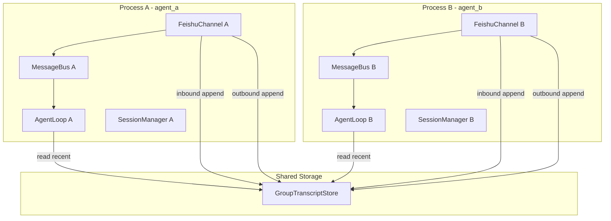

# 多 Agent 跨进程消息共享方案

## 问题背景

- 每个 Agent 独立进程，各自拥有独立的 MessageBus
- 飞书不向其他机器人推送「机器人发送的消息」事件
- 各 Agent 的 session 只记录自己的对话，无法看到其他 Agent 的回复
- 导致：相关性判断不准、上下文缺失（如「继续」等 follow-up 无法正确关联）

## 架构图

## 方案：共享群聊 Transcript 存储

在 `~/.nanobot/transcripts/` 下维护群聊的完整对话记录，按 `{channel}:{chat_id}` 分文件，多进程共享读写。

### 1. 新建 GroupTranscriptStore 模块

**文件**: `nanobot/transcript/store.py`

- `append(session_key: str, role: str, content: str, sender: str, message_id: str | None = None, timestamp_ms: float | None = None)`
- `get_recent(session_key: str, max_messages: int = 20) -> list[dict]`
  - 返回格式与 `session.get_history()` 兼容：`[{role, content, sender?}]`，用于 relevance check 的 prompt
  - 按时间排序，对 inbound 用 `message_id` 去重（同一用户消息可能被多进程各写一次）
- 存储格式：JSONL，每行 `{"role","content","sender","message_id","ts"}`
- 文件名：复用 [nanobot/utils/helpers.py](nanobot/utils/helpers.py) 的 `safe_filename(session_key)`

### 2. 写入点

**Inbound**（用户消息）—— [nanobot/channels/feishu.py](nanobot/channels/feishu.py) `_on_message`：

- 在 `chat_type == "group"` 且通过所有筛选后、调用 `_handle_message` 前
- 调用 `GroupTranscriptStore.append(session_key, "user", content, sender_id, message_id=message_id)`

**Outbound**（Agent 回复）—— [nanobot/channels/manager.py](nanobot/channels/manager.py) `_dispatch_outbound`：

- 对 `msg.channel == "feishu"` 且 `msg.metadata.get("chat_type") == "group"` 的消息
- 在 `channel.send(msg)` 成功后，调用 `GroupTranscriptStore.append(session_key, "assistant", content, agent_name)`，其中 `agent_name = self.config.agent_name`
- 需保证 OutboundMessage 的 metadata 包含 `chat_type`：当前 [nanobot/agent/loop.py](nanobot/agent/loop.py) 在返回 OutboundMessage 时已传入 `metadata=msg.metadata`，飞书 InboundMessage 的 metadata 中已有 `chat_type`，因此无需改动

### 3. 读取点与使用方式

**AgentLoop** 需要「群聊完整历史」的来源：

- 在 [nanobot/agent/loop.py](nanobot/agent/loop.py) 中注入 `GroupTranscriptStore`（或通过可选的 `transcript_store` 参数）
- 在 `_check_relevance` 中：
  - 当 `metadata.get("chat_type") == "group"` 且存在 `group_members` 时
  - 使用 `transcript_store.get_recent(session_key, 20)` 替代或补充 `session.get_history()`
  - 将返回结果转换为当前 prompt 所需格式（含 `you (this agent)` 与 `user` 的区分）
- 在 `context.build_messages` 调用时（如需将群聊完整历史加入 LLM 上下文）：
  - 对于 group 会话，可传入 transcript 的 recent 作为额外 history，或扩展 `build_messages` 支持 `transcript_history` 参数

### 4. 依赖与初始化

- `GroupTranscriptStore` 的 `base_dir` 使用 `get_nanobot_home() / "transcripts"`
- `ChannelManager` 创建时实例化 `GroupTranscriptStore`，并传入 Feishu channel（或通过回调）用于 inbound 写入；outbound 写入在 ChannelManager 内完成
- `AgentLoop` 需接收 `transcript_store: GroupTranscriptStore | None = None`，在 `run` 命令中从 `ChannelManager` 或全局 store 传入

### 5. 可选：Feishu API 拉取历史

若文件存储不可靠（如多机部署、无共享文件系统），可增加「按需拉取飞书会话历史」的实现：

- 在 `FeishuChannel` 中实现 `list_recent_messages(chat_id: str, limit: int) -> list`
- 使用飞书 `GET /open-apis/im/v1/messages`（或等效 list 接口）获取历史
- `GroupTranscriptStore.get_recent` 可支持 fallback 到该 API

本方案先以文件存储为主，API 作为后续扩展。

---

## 实现要点

| 项目  | 说明                                                                   |
| --- | -------------------------------------------------------------------- |
| 并发  | JSONL append 单行写入，多进程 append 可接受；读取时按 `message_id` 去重                |
| 作用域 | 仅对 `chat_type == "group"` 写入 transcript                              |
| 兼容  | `transcript_store is None` 时，AgentLoop 退化为仅用 session，不改动现有单 Agent 行为 |

## 文件变更清单

1. **新建** `nanobot/transcript/__init__.py`、`nanobot/transcript/store.py` — GroupTranscriptStore
2. **修改** [nanobot/channels/feishu.py](nanobot/channels/feishu.py) — inbound 时 append
3. **修改** [nanobot/channels/manager.py](nanobot/channels/manager.py) — 创建 transcript_store；outbound dispatch 后 append
4. **修改** [nanobot/agent/loop.py](nanobot/agent/loop.py) — 接受 transcript_store；`_check_relevance` 中优先使用 transcript
5. **修改** [nanobot/cli/commands.py](nanobot/cli/commands.py) — run 命令中实例化 transcript_store 并注入 AgentLoop、ChannelManager

