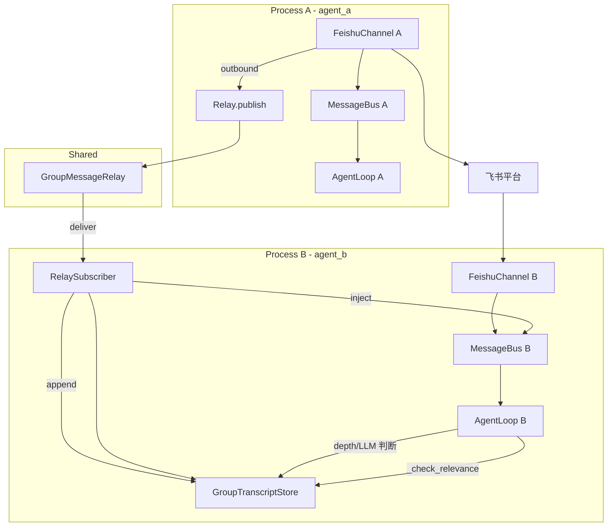
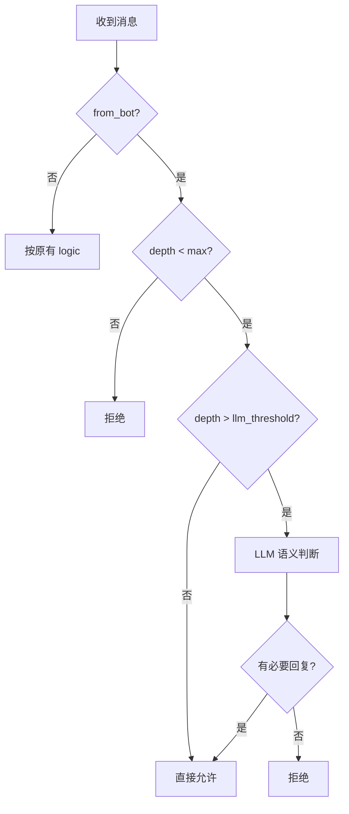

# 多 Agent 间通信设计文档

本文档汇总飞书群聊场景下，多 Agent 跨进程通信的完整设计方案。

---

## 一、问题背景

### 1.1 现状

- 每个 Agent 独立进程运行，拥有独立的 MessageBus
- 飞书平台限制：**机器人发送的消息不会触发 `im.message.receive_v1`**，其他机器人收不到
- 各 Agent 的 session 仅记录自身对话，无法看到其他 Agent 的回复
- 导致：相关性判断不准（如「继续」「结果呢」等 follow-up 被误判）、上下文缺失、无法正确参与多 bot 协作

### 1.2 目标

1. 补齐飞书未推送的机器人消息，使各 Agent 能感知其他 Agent 的发言
2. 保持现有 Agent 处理逻辑（含 @mention 解析、相关性判断等）基本不变
3. 避免 Agent 间无限自主对话
4. 保证消息不可重复消费

---

## 二、总体架构

### 2.1 方案概述

采用 **Relay 中继 + Transcript 存储** 的混合架构：

- **Relay**：当某 Agent 向飞书群发送消息后，通过共享中继将消息「注入」到其他 Agent 的 MessageBus，相当于把飞书没做的事情补上
- **Transcript**：共享群聊完整对话记录，用于深度计算、LLM 语义判断、以及用户消息的上下文
- **停止策略**：回合深度限制 + LLM 语义判断（带阈值），控制 bot 间对话回合

### 2.2 架构图



### 2.3 数据流

| 阶段 | 数据流 |
|------|--------|
| 用户发消息 | 飞书 → 各 Agent 的 FeishuChannel → 写入 transcript → publish_inbound → Agent 处理 |
| Agent A 回消息 | Agent A → bus → ChannelManager → FeishuChannel.send() → 飞书 API；同时 Relay.publish() |
| 其他 Agent 接收 | Relay → RelaySubscriber → append transcript → 构造 InboundMessage → bus.publish_inbound → Agent 处理（含 from_bot 停止策略） |

---

## 三、核心组件

### 3.1 GroupMessageRelay（中继服务）

**职责**：跨进程分发「某 Agent 向群发送的消息」。

**后端选择**：
- **Redis Pub/Sub**（推荐）：`publish` 到 `nanobot:feishu:outbound`，各进程 subscribe
- **文件队列**：`~/.nanobot/relay/outbound.jsonl`，轮询新行（无 Redis 时）

**发布 payload**：
```json
{
  "relay_msg_id": "uuid 或 sender:chat_id:ts:hash",
  "channel": "feishu",
  "chat_id": "oc_xxx",
  "content": "...",
  "sender_bot_open_id": "ou_xxx",
  "sender_agent_name": "agent_a",
  "metadata": { "chat_type": "group", "group_policy": "auto", ... }
}
```

### 3.2 RelaySubscriber（订阅器）

**职责**：每个 Agent 进程内运行，接收 relay 消息并注入本地 bus。

**流程**：
1. 收到消息 → 检查 `relay_msg_id` 是否已处理（去重）
2. 若已处理 → 跳过
3. 若未处理 → 加入 `ProcessedRelayStore`；append 到 transcript；解析 @mention 计算 `is_mentioned`；构造 InboundMessage（含 `from_bot: true`）；`bus.publish_inbound()`

**@mention 解析**：content 中若有 `@BotB` 或 `<at id=ou_B></at>`，则对 Bot B 的 metadata 设置 `is_mentioned: true`。依赖 `groups.json` 的 name → feishu_open_id 映射。

### 3.3 ProcessedRelayStore（去重）

**职责**：记录已处理的 `relay_msg_id`，避免重复消费。

**实现**：
- 内存：`OrderedDict`，超过 5000 条 FIFO 淘汰
- 或文件：`~/.nanobot/relay/processed/{agent_name}.jsonl`

### 3.4 GroupTranscriptStore（共享 transcript）

**职责**：按 `{channel}:{chat_id}` 存储群聊完整对话，供深度计算、LLM 判断、`_check_relevance` 使用。

**写入点**：
- Feishu 收到用户消息 → append (role=user)
- ChannelManager 发送成功后 → append (role=assistant, sender=agent_name)
- RelaySubscriber 注入前 → append (role=assistant, sender=agent_name)

**格式**：JSONL，`{"role","content","sender","message_id","ts"}`

---

## 四、Bot 间对话停止策略

### 4.1 策略结构

采用 **三层策略**：

1. **硬限制**：`depth >= max_bot_reply_depth` → 直接拒绝
2. **阈值控制**：`depth <= bot_reply_llm_threshold` → 直接允许（不调 LLM）
3. **LLM 语义判断**：`llm_threshold < depth < max` → 调用 LLM 判断是否仍有必要回复

### 4.2 深度定义

- `depth` = 当前连续 bot-to-bot 的回合数（不含用户消息）
- 例：用户 → A → B → A，则 A 收到 B 时 depth = 2

**计算方式**：从 transcript 取最近 N 条，从尾向前数连续 `role=="assistant"` 的数量 + 1（当前消息）

### 4.3 决策流程



### 4.4 LLM 判断要点

- 输入：最近 transcript、当前 bot 消息、本 agent 角色
- 拒绝：礼貌性回复（好的/谢谢/OK）、无实质内容、对话已结束
- 允许：实质性问题、需本 agent 参与的任务、未完成协作
- 输出：YES / NO

### 4.5 配置项

| 配置项 | 默认值 | 说明 |
|--------|--------|------|
| `max_bot_reply_depth` | 3 | 最大 bot 回合数，达到即拒绝 |
| `bot_reply_llm_threshold` | 1 | depth > 此值且 < max 时才调用 LLM |
| `bot_reply_llm_check` | true | 是否启用 LLM 语义判断 |

示例：threshold=1, max=3 → depth 1 直接放行；depth 2 调 LLM；depth 3 拒绝。

---

## 五、Publish 与 Subscribe 接入点

### 5.1 Publish（发送后发布）

**位置**：ChannelManager 的 `_dispatch_outbound`，或 FeishuChannel 的 `send()` 成功后

**条件**：`msg.channel == "feishu"` 且 `metadata.get("chat_type") == "group"`

**需要**：`sender_bot_open_id`（FeishuChannel 暴露 `bot_open_id`）、`sender_agent_name`（config.agent_name）

### 5.2 Subscribe（启动时订阅）

**位置**：gateway 启动时，与 agent.run()、channels.start_all() 并行

**职责**：创建 RelaySubscriber，启动后台任务；收到消息后去重 → append transcript → inject

---

## 六、文件变更清单

| 操作 | 路径 | 说明 |
|------|------|------|
| 新建 | `nanobot/relay/__init__.py` | 导出 GroupMessageRelay, RelaySubscriber |
| 新建 | `nanobot/relay/backend.py` | Redis 或文件队列的 publish/subscribe |
| 新建 | `nanobot/relay/subscriber.py` | RelaySubscriber，含去重、transcript、inject |
| 新建 | `nanobot/transcript/` | GroupTranscriptStore（已有） |
| 修改 | `nanobot/channels/feishu.py` | 暴露 `bot_open_id`；inbound 时 append transcript |
| 修改 | `nanobot/channels/manager.py` | outbound 成功后 relay.publish；outbound 时 append transcript |
| 修改 | `nanobot/agent/loop.py` | `_should_respond` 增加 from_bot 分支；`_should_respond_to_bot`；使用 transcript |
| 修改 | `nanobot/config/schema.py` | FeishuConfig 增加 max_bot_reply_depth, bot_reply_llm_threshold, bot_reply_llm_check |
| 修改 | `nanobot/cli/commands.py` | 创建 relay、RelaySubscriber、transcript_store；启动 subscriber |

---

## 七、兼容与回退

- `relay=None` 时：不 publish、不启动 subscriber，行为与现有一致
- 单 Agent：仅自身进程订阅，不会收到其他 agent 消息，行为不变
- `bot_reply_llm_check=false`：仅用 depth 限制，不调 LLM

---

## 八、实现顺序建议

1. 实现 GroupMessageRelay 与 RelaySubscriber（含去重）
2. 修改 FeishuChannel、ChannelManager 完成 publish 与 transcript 写入
3. 在 gateway 中启动 RelaySubscriber，完成 inject
4. 在 AgentLoop 中实现 from_bot 分支、深度计算、`_should_respond_to_bot`
5. 添加配置项并验证
