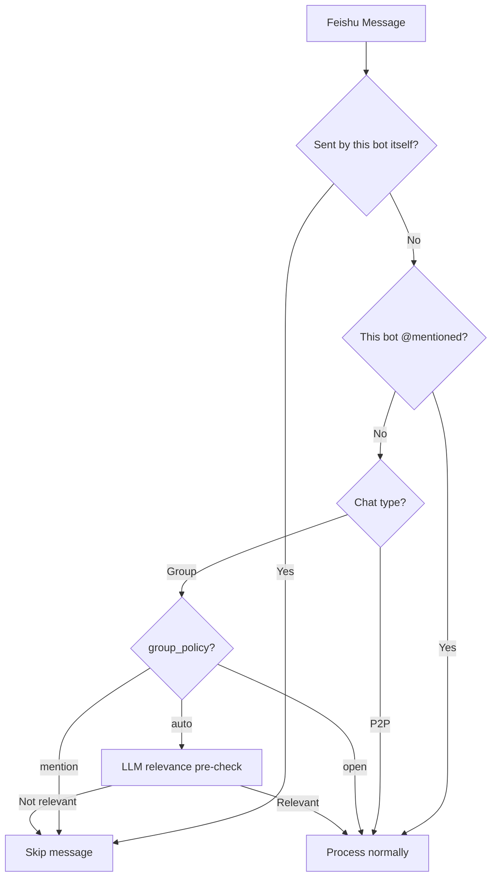

# Multi-Agent Group Chat Routing

## Problem

Two nanobot agents (Feishu bots) are in the same group chat. Currently:

- All bot messages are unconditionally skipped (`feishu.py` line 260: `if sender_type == "bot": return`)
- Every user message triggers a response from **both** agents, causing duplicate replies
- Agents cannot @mention each other (bot messages are dropped)

## Architecture




Key rule: messages from **other bots** are treated identically to user messages (same @mention check, same group_policy routing). Only messages from **this bot itself** are unconditionally skipped.

## Changes

### 1. FeishuConfig: add `group_policy` field

In [nanobot/config/schema.py](nanobot/config/schema.py), add to `FeishuConfig`:

```python
group_policy: str = "auto"  # "mention" | "auto" | "open"
```

- `"mention"` -- only respond when explicitly @mentioned (cheapest)
- `"auto"` -- @mention always responds; non-mentioned messages go through LLM relevance pre-check (hybrid)
- `"open"` -- respond to all group messages (current behavior, for backward compat)

### 2. Feishu Channel: bot identity + @mention parsing

In [nanobot/channels/feishu.py](nanobot/channels/feishu.py):

**a) Get bot's own `open_id` at startup** by calling `GET /open-apis/bot/v3/info` using the lark client. Store as `self._bot_open_id`. This is needed to check if @mentions target this bot.

**b) Rewrite `_on_message()**` to replace the blanket `if sender_type == "bot": return` with:

- **Self-sent check**: Compare sender's `open_id` with `self._bot_open_id`. If it matches → skip (prevent self-loop). This is the ONLY reason to skip a message unconditionally.
- Parse `message.mentions` (list of `{key, id, name}`) from the event
- Check if `self._bot_open_id` is in the mentioned IDs → set `is_mentioned = True`
- Messages from other bots are treated **identically** to user messages:
  - **P2P** → process (no change)
  - **Group + mentioned** → process
  - **Group + not mentioned** → pass to bus with `metadata["is_mentioned"] = False` and `metadata["group_policy"] = config.group_policy`

**c) Strip @mention placeholders** (e.g. `@_user_1`) from the message text for cleaner LLM input, but preserve the mention names for context.

### 3. AgentLoop: relevance pre-check before full processing

In [nanobot/agent/loop.py](nanobot/agent/loop.py):

**a) Add a `_should_respond()` method** at the top of `_process_message()`:

- If `metadata.get("is_mentioned")` is True or missing (non-feishu channels) → return True
- If `metadata.get("group_policy") == "mention"` → return False (skip non-mentioned)
- If `metadata.get("group_policy") == "open"` → return True
- If `metadata.get("group_policy") == "auto"` → call `_check_relevance()`

**b) Add `_check_relevance()` method** that does a lightweight LLM call:

- Build a minimal prompt using the agent's AGENTS.md / SOUL.md role description (from `ContextBuilder._load_bootstrap_files()`)
- Send a structured prompt like: "You are an agent named X with the following role: {role}. A message was sent in a group chat: '{message}'. Should you respond? Reply ONLY 'YES' or 'NO'."
- Use the same provider but with `max_tokens=3` for efficiency
- Parse the response: if "YES" → relevant, otherwise → not relevant

**c) In `_process_message()**`, early-return `None` if `_should_respond()` returns False. This means no OutboundMessage is published and no session history is saved for skipped messages.

### 4. Metadata flow through InboundMessage

No schema changes needed -- [nanobot/bus/events.py](nanobot/bus/events.py) `InboundMessage.metadata` is already `dict[str, Any]`, sufficient to carry `is_mentioned`, `group_policy`, `chat_type`, and `mentions` data.

## Key Design Decisions

- **Bot identity**: Fetched automatically at startup via Feishu API, no extra config field needed
- **Relevance check location**: In AgentLoop (not in channel), because the agent already has the LLM provider and role context
- **Cost control**: The LLM pre-check uses `max_tokens=3` and a minimal prompt (~200 tokens input). Only fires for non-mentioned group messages in "auto" mode
- **P2P messages**: Always processed, unaffected by group_policy
- **Other channels**: Unaffected -- `_should_respond()` defaults to True when metadata keys are absent

